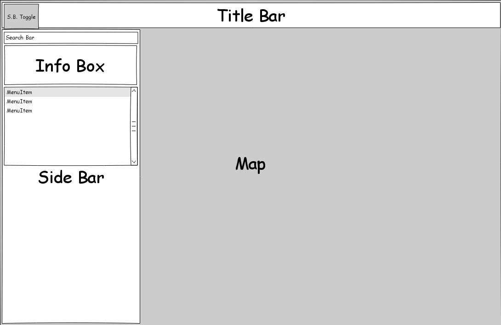
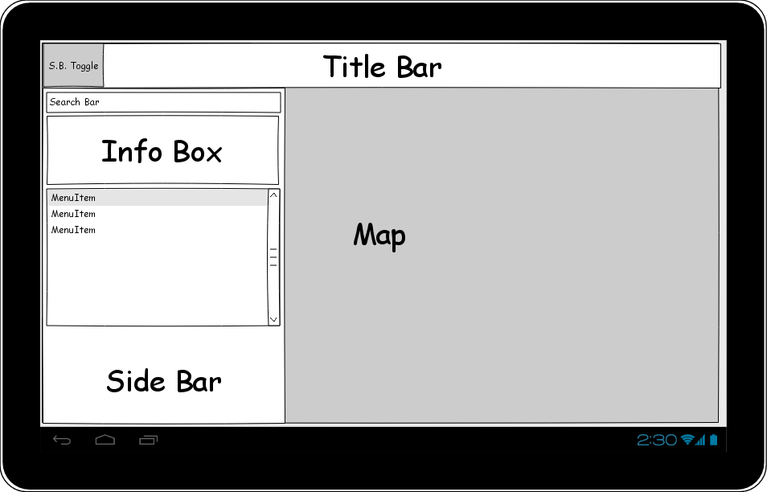
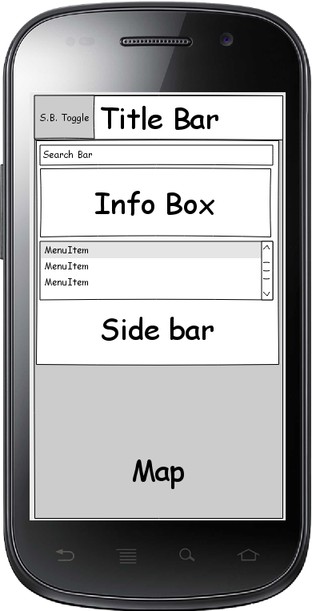

Behaviour Driven Development
============================
Layout design
-------------
The page should be scalable and easily viewable on phone, tablet and desktop.
The page should exist of the following sections on each device.

	* header: A fixed bar on top with the title and a menu button on the left to toggle the floating sidebar.
	* Map: A full screen map
	* Sidebar: The sidebar should overlay the map and should consist of 3 sections.
		* Searchbar: enter an area and zoom towards it
		* Info Window: extra info about the specific area will be displayed here.
		* list; show a list of all the neighbouring areas.

Desktop
^^^^^^^

Tablet
^^^^^^

Phone
^^^^^

Behaviours
----------
PageLoad
^^^^^^^^
When the page loads, the following actions should be taken

	* The page should center to central London
	* The Side Bar should be hidden
	* Check which area is in the center of the page and retrieve the following from the police database:
		* boundaries of the area
		* All the police stations within the area
		* Create a list of total crimes commited within the boundaries
		* Add the neighbourhood to the list
	* Display the boundaries of the area

Neighborhood Selection
^^^^^^^^^^^^^^^^^^^^^^
The user can click on neighborhoods which are already defined or not:

Already defined:
++++++++++++++++

	* Pan and zoom to the area
	* Change the neighborhood info in the sidebar

Not defined:
++++++++++++

	* Center map to the location clicked
	* Retrieve information from police database
	* Draw neighborhood polygon
	* Add neighborhood to the list in sidebar
	* Show crime info in the sidebar

Change of Date
^^^^^^^^^^^^^^
Unset all the map polygons and erase all the crime, and police neigborhood data.
Get police data for the current map center, with the defined date range.

